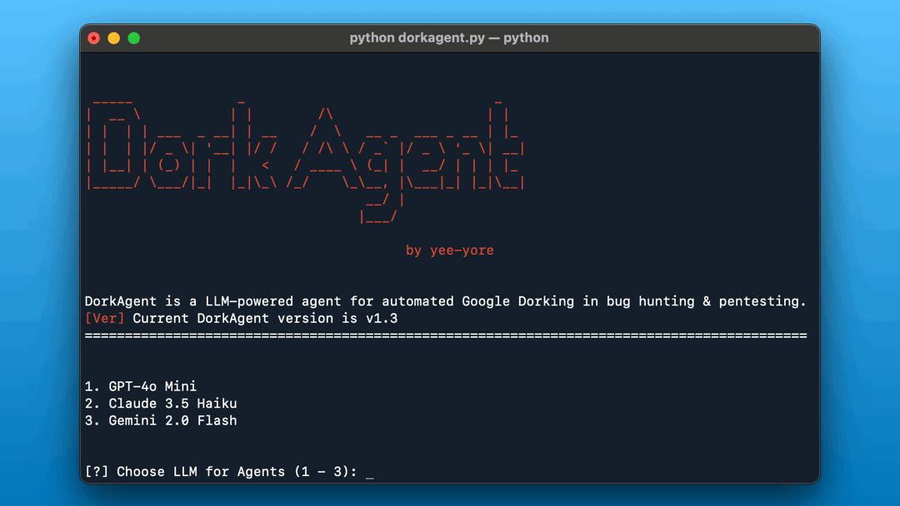

# DorkAgent
🤖 LLM-powered agent for automated Google Dorking in bug hunting &amp; pentesting.

                   
                                                                                                    
## Usage
1. Git clone
```bash
git clone https://github.com/yee-yore/DorkAgent.git
cd DorkAgent
```

2. Run DorkAgent
```bash
python dorkagent.py
```

The program will:
- **Auto-install** all required packages on first run
- **Prompt for API keys** and save them to `.env` file automatically

Required API keys:
- `SERPER_API_KEY` - **Required** (Get from https://serper.dev/)
- At least **one** LLM API key:
  - `OPENAI_API_KEY` - For GPT-4.1 Mini
  - `ANTHROPIC_API_KEY` - For Claude 3.5 Haiku
  - `GEMINI_API_KEY` - For Gemini 2.5 Flash

For more description
https://medium.com/@yee-yore/llm-powered-agent-for-automated-google-dorking-dcb14d609dc2

## Customize
1. The number of google results (`serper_dev_tool.py` inside `site-packages/crewai_tools/tools/serper_dev_tool/`)
```bash
class SerperDevTool(BaseTool):
    ...
    args_schema: Type[BaseModel] = SerperDevToolSchema
    base_url: str = "https://google.serper.dev"
    n_results: int = 10 # min: 10, max: 100
    ...
```
2. Duration of google search results (`serper_dev_tool.py`)

```bash
# https://serper.dev/playground

def _make_api_request(self, search_query: str, search_type: str) -> dict:
    ...
    payload = json.dumps({"q": search_query, "num": self.n_results, "tbs": "qdr:m"}) # Past week: "qdr:w", Past month: "qdr:m"
    ...
```
3. Google dorks (`task()`)
```bash
# Reference https://github.com/TakSec/google-dorks-bug-bounty
```
4. Agents (`agents()`)
```bash
# https://docs.crewai.com/concepts/agents
```


## Update Log
- **2025-09-29**: Major code refactoring for improved maintainability (@wjdrud2532 PR #3). Split monolithic 800+ line file into modular architecture (config.py, agents.py, tasks.py, utils.py), fixed dependency auto-installation to work before module imports, added timestamps to report filenames (YYMMDD_HHMMSS format), enforced code conventions with standardized import order and removed all inline comments, maintained 100% backward compatibility with no breaking changes
- **2025-08-11**: **DorkAgent v1.4** - Enhanced security reports with specific information disclosure details, fixed critical notification race condition bug, improved attack vector analysis with actual parameters and payloads, added comprehensive development documentation (CLAUDE.md), restored requirements.txt format
- **2025-05-18**: Modified README.md and banner, Added juicy google dorks, Medium article (https://medium.com/@yee-yore/llm-powered-agent-for-automated-google-dorking-dcb14d609dc2)
- **2025-04-17**: Removed tasks(old).py, the version prior to prompt engineering; Deleted Google Dork for finding "Confidential" documents (most results were merely informative); Removed Google Dork targeting login panels; Added settings to help avoid LLM provider rate limits; Integrated Gemini Flash 2.0 (free to use and currently considered the best value LLM); Merged tasks.py and agents.py into dorkagent.py for simplified maintenance
- **2025-04-01**: Added hybrid LLM option (GPT & Claude); Added dork `intitle:"IIS Windows Server"`; Applied prompt engineering to tasks.py; Added default depth consideration for subdomain inputs; Added `requirements.txt` for Windows/MacOS compatibility