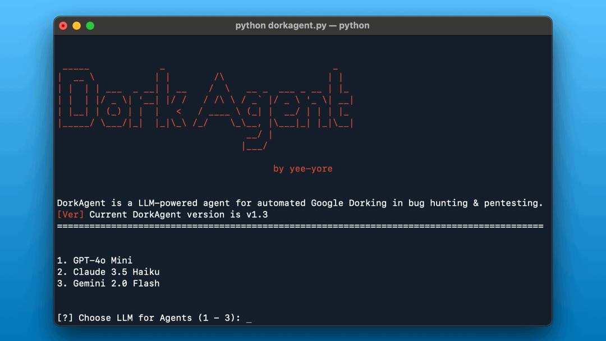

# DorkAgent
🤖 LLM-powered agent for automated Google Dorking in bug hunting &amp; pentesting.

                   
                                                                                                    
## Requirements
- Python 3.11.x (recommended: 3.11.9)
- Newer versions (e.g. 3.13+) may fail to install `crewai`'s dependencies (such as `tiktoken`) because no prebuilt wheel is published yet for them — pip then tries to build from source and fails without a Rust compiler installed. If you hit a `tiktoken` build error, switch to Python 3.11.x.

## Usage
1. Git clone
```bash
git clone https://github.com/yee-yore/DorkAgent.git
cd DorkAgent
```

2. Run DorkAgent
```bash
python dorkagent.py
```

The program will:
- **Auto-install** all required packages on first run
- **Prompt you to choose a search engine** (Serper or SerpApi) and an LLM provider
- **Prompt for API keys** and save them to `.env` file automatically

Required API keys:
- **One** search engine key, depending on your choice at runtime:
  - `SERPER_API_KEY` - For Serper (Get from https://serper.dev/)
  - `SERPAPI_API_KEY` - For SerpApi (Get from https://serpapi.com/manage-api-key)
- At least **one** LLM API key:
  - `OPENAI_API_KEY` - For OpenAI models (GPT-4, GPT-5, etc.)
  - `ANTHROPIC_API_KEY` - For Claude models
  - `GEMINI_API_KEY` - For Gemini models

For more description
https://medium.com/@yee-yore/llm-powered-agent-for-automated-google-dorking-dcb14d609dc2

## Customize
1. The number of google results
   - **Serper** (`serper_dev_tool.py` inside `site-packages/crewai_tools/tools/serper_dev_tool/`)
   ```bash
   class SerperDevTool(BaseTool):
       ...
       args_schema: Type[BaseModel] = SerperDevToolSchema
       base_url: str = "https://google.serper.dev"
       n_results: int = 10 # min: 10, max: 100
       ...
   ```
   - **SerpApi** (`serpapi_google_search_tool.py` inside `site-packages/crewai_tools/tools/serpapi_tool/`) — by default it only forwards `q`/`location` to SerpApi, so add a `"num"` key to the `client.search({...})` dict in `_run()` to control result count.
2. Duration of google search results
   - **Serper** (`serper_dev_tool.py`)
   ```bash
   # https://serper.dev/playground

   def _make_api_request(self, search_query: str, search_type: str) -> dict:
       ...
       payload = json.dumps({"q": search_query, "num": self.n_results, "tbs": "qdr:m"}) # Past week: "qdr:w", Past month: "qdr:m"
       ...
   ```
   - **SerpApi** (`serpapi_google_search_tool.py`) — same idea, add a `"tbs"` key to the `client.search({...})` dict in `_run()`:
   ```bash
   # https://serpapi.com/search-api (tbs param)

   results = self.client.search({
       "q": kwargs.get("search_query"),
       "location": kwargs.get("location"),
       "tbs": "qdr:m", # Past week: "qdr:w", Past month: "qdr:m"
   }).as_dict()
   ```
3. Google dorks (`task()`)
```bash
# Reference https://github.com/TakSec/google-dorks-bug-bounty
```
4. Agents (`agents()`)
```bash
# https://docs.crewai.com/concepts/agents
```


## Update Log
- **2026-08-24**: Added selectable search engine for Google Dorking — choose Serper or SerpApi at runtime (`select_search_engine()` in config.py), same pattern as the existing LLM provider selection
- **2026-08-24**: Fixed compatibility with crewai 1.15.17 — switched OpenAI to CrewAI's native LLM wrapper (`ChatOpenAI` no longer accepted by `Agent`), added `crewai[anthropic]`/`crewai[google-genai]` extras so Anthropic/Gemini native providers install correctly; added retry-on-invalid-API-key flow instead of exiting; added passive-OSINT context to the searcher task so it doesn't refuse recon on large/well-known domains; documented the Python 3.11.x requirement
- **2025-12-11**: **DorkAgent v1.4** - Dynamic model selection via API (choose from available models at runtime), added Pydantic models for structured task output validation, improved code quality with CONVENTIONS.md compliance fixes
- **2025-09-29**: Major code refactoring for improved maintainability (@wjdrud2532 PR #3). Split monolithic 800+ line file into modular architecture (config.py, agents.py, tasks.py, utils.py), fixed dependency auto-installation to work before module imports, added timestamps to report filenames (YYMMDD_HHMMSS format), enforced code conventions with standardized import order and removed all inline comments, maintained 100% backward compatibility with no breaking changes
- **2025-08-11**: Enhanced security reports with specific information disclosure details, fixed critical notification race condition bug, improved attack vector analysis with actual parameters and payloads, added comprehensive development documentation (CLAUDE.md), restored requirements.txt format
- **2025-05-18**: Modified README.md and banner, Added juicy google dorks, Medium article (https://medium.com/@yee-yore/llm-powered-agent-for-automated-google-dorking-dcb14d609dc2)
- **2025-04-17**: Removed tasks(old).py, the version prior to prompt engineering; Deleted Google Dork for finding "Confidential" documents (most results were merely informative); Removed Google Dork targeting login panels; Added settings to help avoid LLM provider rate limits; Integrated Gemini Flash 2.0 (free to use and currently considered the best value LLM); Merged tasks.py and agents.py into dorkagent.py for simplified maintenance
- **2025-04-01**: Added hybrid LLM option (GPT & Claude); Added dork `intitle:"IIS Windows Server"`; Applied prompt engineering to tasks.py; Added default depth consideration for subdomain inputs; Added `requirements.txt` for Windows/MacOS compatibility